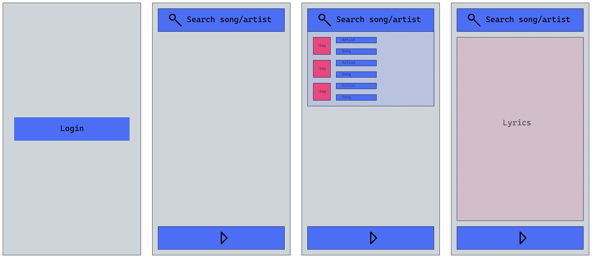

## 💻 Better than Spotify

## 🛠️ Mockup del proyecto

## ⚙️ Tecnologías utilizadas en el proyecto

<ul>
        <li>React</li>
        <li>Ionic</li>
        <li>Node Js</li>
        <li>Express Js</li>
        <li>Jest</li>
        <li>TypeScript</li>
        <li>npm</li>
        <li>Bootstrap/React Boostrap</li>
</ul>

## 🔍 Instalación:

     *** Tener instalado el Visual Studio Code y el Node js

    
<ul>
        <li>Clonamos el repositorio utilizamos el comando:</li>
            
git clone <i>https://github.com/Lorelain90/better-than-spotify.git</i>

        <li>Instalamos Node Package Manager: </li>
            
npm install / npm i

            
*** En el "server-nest" además, tenemos que ejecutar el comando (para que cree el archivo "dist"): 
npm run build

        <li>Abrimos sesión en <i>https://developer.spotify.com/dashboard</i>, clicamos en"crear una app" y  dentro de esta, en "Editar ajustes", agregamos <i>http://localhost:8100</i> en el apartado de "Redirigir URIs" </li>
        <li>Creamos un documento ".env" fuera del archivo src de: </li>
            
📂"client" / "client-ionic"

            <ul>
                <li>REACT_APP_REDIRECT_URI= http://localhost:8100</li>
                <li>REACT_APP_CLIENT_ID= _ _ _ _ _ _ _ _(El que nos aporta la página al crear la app)</li>
            </ul>
            
📂"server" / "server-express" / "server-nest"

            <ul>
                <li>REDIRECT_URI= http://localhost:8100</li>
                <li>CLIENT_ID=_ _ _ _ _ _ _ _(El que nos aporta la página al crear la app)</li>
                <li>CLIENT_SECRET=_ _ _ _ _ _ _ _(El que nos aporta la página al crear la app)</li>
                <li>PORT= 3001</li>
            </ul>
        <li>Vizualizamos el proyecto ejecutando en un terminal integrado uno para client y otro para server:</li>
        <ol>
            <li>📂 El "client" usando el comando:</li>
                
npm start

            <li>📂 El "client-ionic" usando el comando:</li>
                
ionic serve / ionic serve --lab

        </ol>
        
Y

        <ol>
            <li>📂 El "server" usando el comando:</li>
                
npm run devStart

            <li>📂 El "server-express" usando el comando:</li>
                
npm run start:dev

            <li>📂 El "server-nest" usando el comando:</li>
                
npm run start

        </ol>
        <li>Para correr los test usamos el comando:</li>
            
npm run test

</ul>    

## ✒️ Personas autoras

<ul>
        <li><a href="https://github.com/Lorelain90">Lorena</a></li>
        <li><a href="https://github.com/JcUrki">Jaciniris</a></li>
</ul>